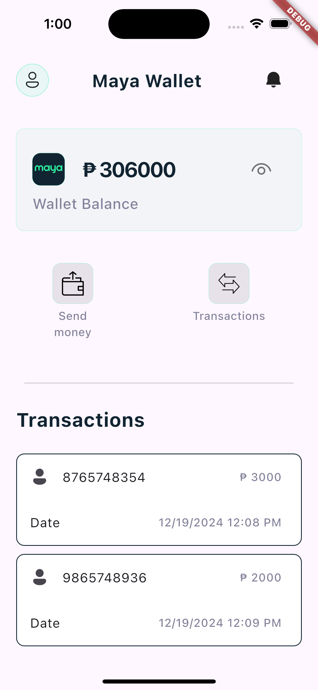
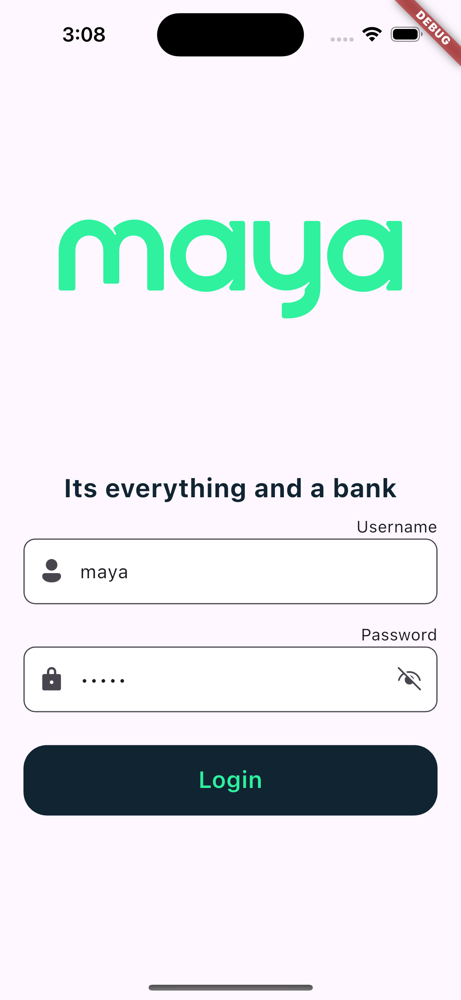

# digitalbankapp

Digital banking app 

## Getting Started

Run the following command in the project directory to fetch all dependencies:

Install Dependencies
- flutter clean
- flutter pub get

Run the Project
On iOS Simulator or Device / On Android Emulator or Device
- flutter run

Login credentials
- username :  maya
- password : 12345

